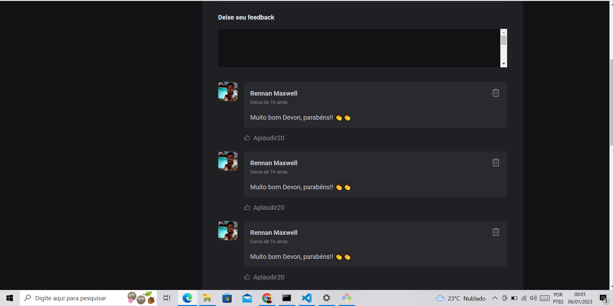

# IGNITE FEED


## Setup Instructions

This project uses Vite + ReactJs.

Start by installing dependencies:

```
npm install
```

Boot up a dev server:

```
npm run dev
```

You should be able to access the application at `http://localhost:3001`.


<br />




